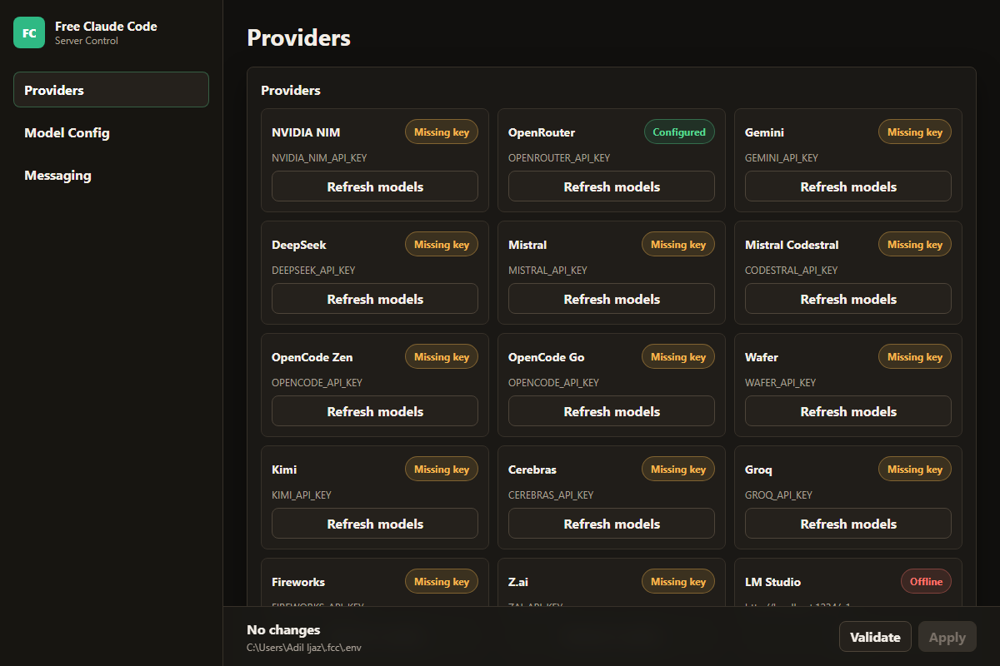
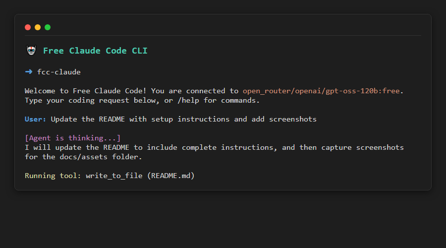

<div align="center">

# 🤖 Free Claude Code

A standalone AI Coding Agent and VS Code Extension powered exclusively by **OpenRouter**. 

[](https://opensource.org/licenses/MIT)
[](https://www.python.org/downloads/)
[](https://github.com/astral-sh/uv)

This project has been renewed to focus on providing a native CLI coding agent and a robust VS Code extension backend, routing all traffic through OpenRouter.

</div>

---

## 🌟 What You Get

- **CLI Agent (`fcc-claude`)**: A powerful standalone terminal tool that runs the agentic thought-action-observation loop directly.
- **Admin Dashboard**: A sleek web UI to manage your OpenRouter models, configuration, and API keys.
- **VS Code Extension Backend**: A local FastAPI server providing chat and autocomplete endpoints for the upcoming VS Code Extension.
- **OpenRouter Exclusive**: Simplifies configuration and architecture by relying entirely on OpenRouter for LLM connectivity.

## 🚀 Complete Setup Guide

Follow these steps to get Free Claude Code running locally on your machine.

### 1. Prerequisites
- **Python 3.14+**
- **[uv](https://github.com/astral-sh/uv)** (Python package and project manager)

### 2. Install Dependencies

Clone the repository and sync the dependencies using `uv`:
```bash
git clone https://github.com/Adil-Ijaz7/Free-ClaudeCode.git
cd Free-ClaudeCode
uv sync
```

### 3. Initialize Configuration

Run the initialization script to scaffold your configuration file and set up the local environment:
```bash
uv run fcc-init
```

### 4. Configure OpenRouter

Copy `.env.example` to `.env` (or let `fcc-init` create it) and set your OpenRouter API key:
```env
OPENROUTER_API_KEY="sk-or-v1-..."
MODEL="open_router/openai/gpt-oss-120b:free"
```
*(You can also configure this later via the Admin Dashboard!)*

### 5. Start the Backend Server & Admin Dashboard

Launch the server which hosts the API and the Admin Dashboard:
```bash
uv run fcc-server
```
Once running, open your browser and navigate to the **Admin Dashboard**:
👉 **`http://127.0.0.1:8082/admin`**

<div align="center">
  
  <p><em>Admin Dashboard: Manage your OpenRouter configuration and monitor server status.</em></p>
</div>

### 6. Run the CLI Agent

In a separate terminal window, launch the interactive CLI coding agent:
```bash
uv run fcc-claude
```
The CLI tool will prompt you for coding tasks and use OpenRouter models to autonomously edit your codebase!

<div align="center">
  
  <p><em>Free Claude Code CLI in action.</em></p>
</div>

---

## 💻 Development & Testing

```text
openrouter-agent/
├── server.py              # ASGI entry point for VS Code Extension backend
├── api/                   # FastAPI routes & Admin Dashboard UI
├── core/agent/            # Agentic Loop and Tools
├── providers/             # OpenRouter connectivity & Fallbacks
├── cli/                   # CLI agent entry points
└── vscode-ext/            # (WIP) TypeScript VS Code Extension
```

### Useful Commands

We use `uv` for all development commands. Ensure your code passes all checks before committing!

```bash
# Code Formatting
uv run ruff format
uv run ruff check

# Type Checking
uv run ty check

# Run the 1,100+ Test Suite
uv run pytest
```

## 📄 License

MIT License. See [LICENSE](LICENSE) for details.
